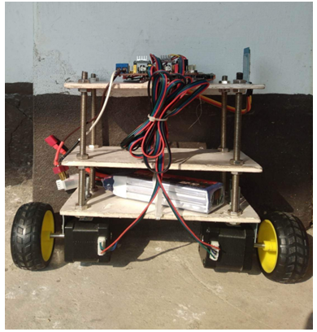
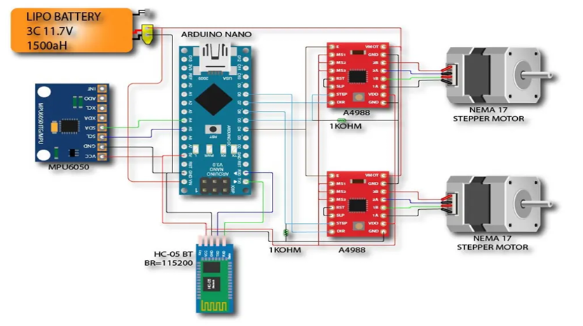
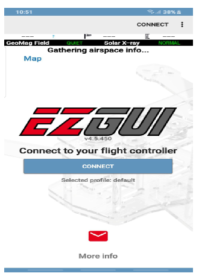

# 🤖 Self-Balancing Robot

A two-wheeled **self-balancing robot** designed using the **inverted pendulum model**.  
It uses an **MPU6050** sensor (gyroscope + accelerometer) and a **PID controller** on **Arduino Nano** to keep the robot balanced.  
The robot can be controlled wirelessly via **Bluetooth** using the **EZ-GUI Ground Station** Android app.

---

## 🖼️ Project Overview

  
*A prototype of the self-balancing robot (replace with your photo)*

---

## 🧠 How It Works

The self-balancing robot maintains its upright position by continuously adjusting motor speed based on sensor feedback.  
The **MPU6050 sensor** measures the tilt and angular velocity.  
The **Arduino Nano** runs a **PID control algorithm** to correct any deviation and stabilize the robot.

**Control Flow:**
1. Sensor detects tilt (angle and rate).
2. Arduino calculates correction using PID.
3. Motor driver adjusts wheel torque.
4. Robot returns to balanced position.

---

## ⚙️ Components Used

| Component | Quantity | Description |
|------------|-----------|-------------|
| Arduino Nano | 1 | Main microcontroller |
| MPU6050 | 1 | 3-axis gyroscope & accelerometer |
| NEMA 17 Stepper Motor | 2 | Drives the robot |
| A4988 Stepper Motor Driver | 2 | Motor control interface |
| HC-05 Bluetooth Module | 1 | Wireless communication |
| CNC Shield V3 | 1 | Motor driver shield for Arduino |
| Li-Po Battery (2200mAh) | 1 | Power source |
| 75mm Wheels | 2 | Mobility |
| Cardboard/Frame | 1 | Robot body |
| Misc. (Wires, Bolts, Nuts) | — | Assembly materials |

---

## 🔌 Circuit Diagram

  
*Circuit diagram showing the connection of MPU6050, Bluetooth, and motor drivers*

---

## 🧩 Working Principle

- **MPU6050 Sensor:** Measures tilt and angular velocity.  
- **Arduino Nano:** Processes sensor data and calculates motor control output using the PID formula:  
  \[
  u(t) = K_p e(t) + K_i \int e(t) dt + K_d \frac{de(t)}{dt}
  \]
- **Motors:** Adjust their speed to maintain vertical balance.
- **Bluetooth Module:** Allows remote commands from the Android app.

---

## 📱 Android Control

The robot is controlled via the **EZ-GUI Ground Station** app, available on the Play Store.

- Connect Bluetooth (HC-05)
- Send directional commands
- Get voice feedback from the app

  
*Android app interface for controlling the robot*

---

## 🚀 Features

- Real-time **PID-based balancing**
- **Wireless Bluetooth** control
- Simple modular design
- Low-cost and easily reproducible
- Suitable for **robotics learning projects**

---

## 🔧 Future Improvements

- Use lightweight materials for better stability  
- Implement **auto tilt calibration**  
- Add **payload carrying** capability  
- Improve **Bluetooth control response**  
- Add **line-following sensor system**

---

## 👨‍💻 Team Members

| Name | Roll | Batch |
|------|------|-------|
| Md. Imran | 1809037 | 2K18 |
| Bishaw Kirti Chakma | 1809061 | 2K18 |

**Supervisor:**  
Md. Khorshed Alom, Assitant Professor  
Department of Electronics and Communication Engineering, KUET
